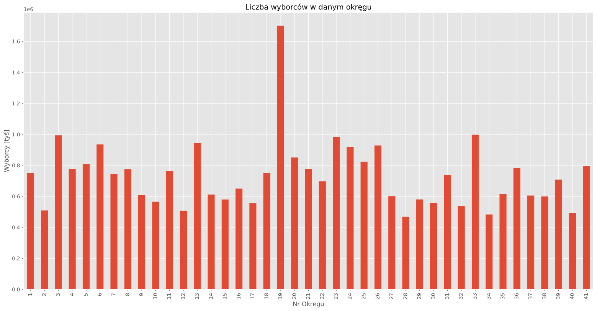

# Elections 2019

## This notebook is used for the initial analysis of constituencies in the elections to the Sejm and Senate in Poland in 2019.

Dataset is available on the government website: https://sejmsenat2019.pkw.gov.pl/sejmsenat2019/pl/dane_w_arkuszach

The analysis includes:
- the number of voters depending on the type of constituency
- voters from outside the country
- the number of voters voting in precincts other than permanent ones

- the number of voters in a given district

- the adaptation of polling stations to people with disabilities

